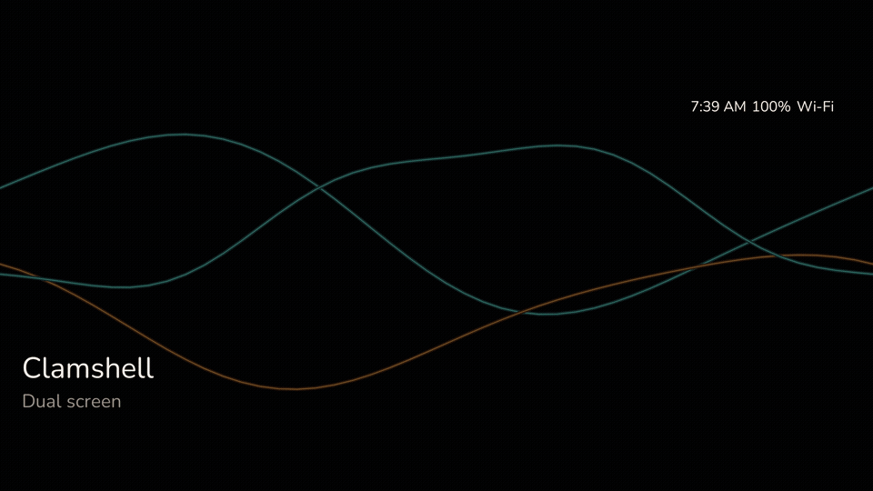
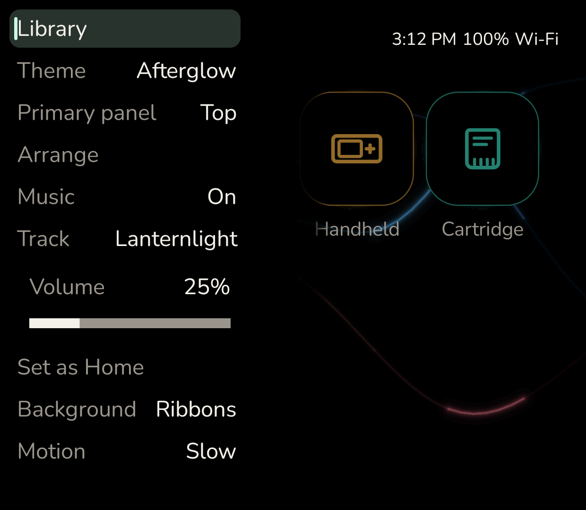

# Foldcade

**A calm, two-screen home for your AYN Thor.**

Open the clamshell and your whole collection is waiting. The game you are thinking about fills the top screen. Everything else sits on a shelf just below it, a press away. Soft music plays while you browse. When you pick something, the music fades, Foldcade steps aside, and the game takes over.

Foldcade is free, open source, and made for one device: the Thor.

<!--
Hero pair. Emulator only, not a Thor pass.
Idle top and grid bottom, copied in place from docs/afterglow/. Keep these paths.

  docs/images/hero-top.png
  docs/images/hero-bottom.png
-->

| Top screen | Bottom screen |
| :---: | :---: |
|  |  |

*Screenshots are from a Thor-sized emulator, not a real Thor.*

## Why Foldcade

Most Android launchers are built for one screen. The Thor has two, and they usually end up feeling like a phone with a spare. Foldcade treats them as one home.

- **Two screens that work together.** The top screen shows off what you have selected. The bottom screen is where you browse. Nothing is cramped, and nothing is wasted.
- **Made for buttons, not fingers.** Everything is reachable with the Thor's own controls. Move with the D-pad, press A to play, and use the shoulder buttons for quick settings.
- **Quiet by design.** No ads, no store, no feeds, no account to make. Just your games, a dark screen, and a little music.

## What you get

### Everything in one place

Your games can live in a few different places. Foldcade brings them together.

- **Games on your Thor.** Point Foldcade at a folder on your device and it finds your games for you.
- **Games on your home server.** If you run [RomM](https://romm.app) at home, sign in once and browse that whole collection from the couch.
- **Android games and apps.** Your installed Android games get their own shelf. Other apps live in a separate drawer, and you can hide the ones you never use.
- **PC games.** Games you have set up in GameNative show up next to everything else.
- **Games streamed from your PC.** Bring in your Moonlight games and stream them from the same home.

### One press, and you are playing

Pick a game and press A. Foldcade opens it in the right app for you: Azahar for 3DS games, melonDS for DS games, GameNative for PC games, or Moonlight for streaming. Games from Game Boy to Switch open in the emulator you already have, such as Dolphin, PPSSPP, DuckStation, NetherSX2, or Eden. If you have more than one for a system, Foldcade uses the first one on its list. You choose whether a game opens on the top or bottom screen, and games that need both screens get both.

### Your saves follow you

If you use RomM, Foldcade keeps your saves backed up to your server. Play on the bus, and the save is there when you get home. If you are offline, it waits and uploads later. If the same game was saved in two places, Foldcade keeps both copies instead of throwing one away.

### See where the hours went

Every game shows how long you have played it and when you last picked it up. Sort your library by **Recently played** to jump straight back into whatever you were in the middle of.

### Make it yours

- **Afterglow**, the first theme, is true black with soft neon tiles and slow, drifting ribbons of light. It is easy on the eyes on a late-night session. More themes are on the way.
- **Arrange your home.** Pick the games you care about most and put them in the order you like.
- **Background music.** Lanternlight, a gentle original track, plays while you browse. Turn the volume down or switch it off whenever you like.
- **A background that suits you.** Choose drifting ribbons, glowing embers, a still frame, or plain black, and slow the motion down if you like it calmer.

## Is Foldcade for you?

Foldcade is a good fit if:

- You have an **AYN Thor** and want both screens to feel like one device.
- You want a **quiet, simple home** for the games you already have.
- You play **retro or console** games in emulators like Dolphin, PPSSPP, or Azahar, use **RomM**, **GameNative**, or **Moonlight**, or just want your Android games tidy.

It might not be for you yet if:

- You do not have a Thor. Foldcade is designed around its two screens.
- You want a finished, polished app today. Foldcade is early and changing quickly.
- You use RetroArch. Foldcade hands games over without a file path, and RetroArch needs one, so it is not supported yet.

## Get Foldcade

Foldcade is installed with **Obtainium**, a free app that installs apps straight from where they are published and keeps them up to date.

1. Install [Obtainium](https://obtainium.imranr.dev) on your Thor.
2. Tap the badge below on your Thor. Obtainium opens with Foldcade ready to add.
3. Add Foldcade, then install it.

Obtainium will let you know when there is an update.

Would rather install it by hand? Download `foldcade.apk` from [Releases](https://github.com/predmore/foldcade/releases) and open it on your Thor.

Want to try new features first? [Test builds](docs/releases.md#include-pre-releases) come out with every change. Expect rough edges.

## Questions

**Does it cost anything?**
No. Foldcade is free and open source.

**Does it come with games?**
No. Foldcade organizes and opens the games you already have.

**Will it replace my Android home screen?**
Only if you want it to. You can open Foldcade like any other app, or choose **Set as Home** in its settings so it is the first thing you see. You can switch back any time in Android settings.

**Do I need a RomM server?**
No. A folder on your Thor works fine. RomM is there if you already use it.

**Does Foldcade keep my password?**
No. RomM sign-in uses a token, and Foldcade does not store your password.

**Is it finished?**
Not yet. Foldcade is early and in active development, so things will change and improve.

## License and credits

Foldcade is open source under the [GNU GPLv3](LICENSE) ([licensing](docs/licensing.md)).

Credits for the home music and the theme art are in [licenses/CREDITS.md](licenses/CREDITS.md). Afterglow’s marks, preview, and sounds are original and licensed under [CC BY-SA 4.0](themes/afterglow/LICENSE). Its display face is Nunito Regular under the [SIL Open Font License](themes/afterglow/OFL-Nunito.txt). The theme contract is in [themes/afterglow/README.md](themes/afterglow/README.md).

## For developers

- [Building](docs/building.md)
- [Plugins](docs/plugins.md)
- [Releases](docs/releases.md)
- [Architecture](docs/architecture.md)
- [Contributing](CONTRIBUTING.md)
