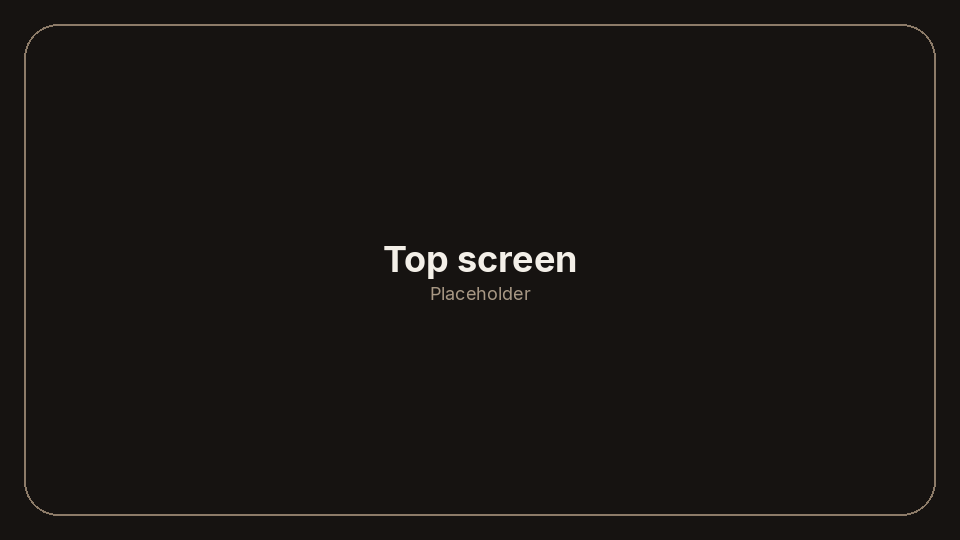
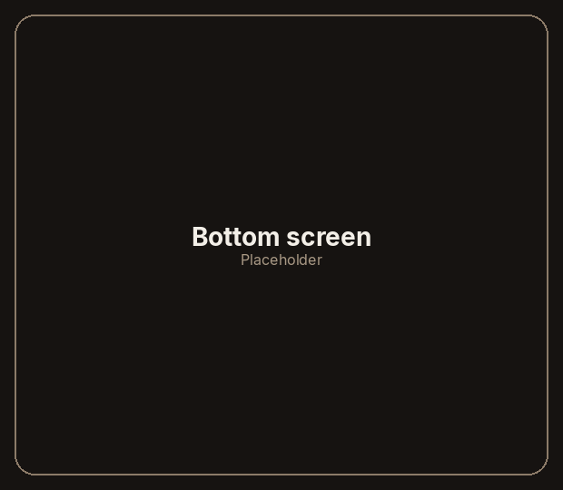

# Foldcade

A calm home for two screens.

Pick up the AYN Thor and open the clamshell. Your whole collection is there: the game you have settled on, and the shelf of everything else just below it. The home glows quietly while you browse, unhurried and easy to sit with.

When you are ready to play, Foldcade gets out of the way. The music fades, the home steps aside, and the game takes the screens.

<!--
Hero pair. Emulator only, not a Thor pass.
Idle top and grid bottom, copied in place from docs/afterglow/. Keep these paths.

  docs/images/hero-top.png
  docs/images/hero-bottom.png
-->

| Top screen | Bottom screen |
| :---: | :---: |
|  |  |

*Emulator only, not a Thor pass.*

## What you can do

- **A two-screen home, built for the Thor.** Both displays belong to the home, so your games have room to spread out across the clamshell.
- **Your library, wherever it lives.** Keep games in a folder on the device, or connect RomM, and browse them from the same place.
- **One press, and you are playing.** Launch straight into Azahar, melonDS, or GameNative, and Foldcade hands the screens over.
- **Themes, starting with Afterglow.** Afterglow is the first look: dark, quiet, and easy on a late session.
- **Lanternlight, while you browse.** A gentle piece of music sits under the home, then fades away when a game starts.
- **Play time and recently played.** Coming in v1, so you can see where the hours went and jump back into what you played last.

**Status:** Early, and in active development. [Pre-releases](docs/releases.md#include-pre-releases) are available for testers.

## Get it

Install [Obtainium](https://obtainium.imranr.dev), tap the badge, and you are done.

Or grab the APK from [GitHub Releases](https://github.com/predmore/foldcade/releases).

## License

Foldcade is open source under the [GNU GPLv3](LICENSE) ([licensing](docs/licensing.md)).

Credits for the home music and the theme art are in [licenses/CREDITS.md](licenses/CREDITS.md). Afterglow’s marks, preview, and sounds are original and licensed under [CC BY-SA 4.0](themes/afterglow/LICENSE). Its display face is Nunito Regular under the [SIL Open Font License](themes/afterglow/OFL-Nunito.txt). The theme contract is in [themes/afterglow/README.md](themes/afterglow/README.md).

## For developers

- [Building](docs/building.md)
- [Plugins](docs/plugins.md)
- [Releases](docs/releases.md)
- [Architecture](docs/architecture.md)
- [Contributing](CONTRIBUTING.md)
